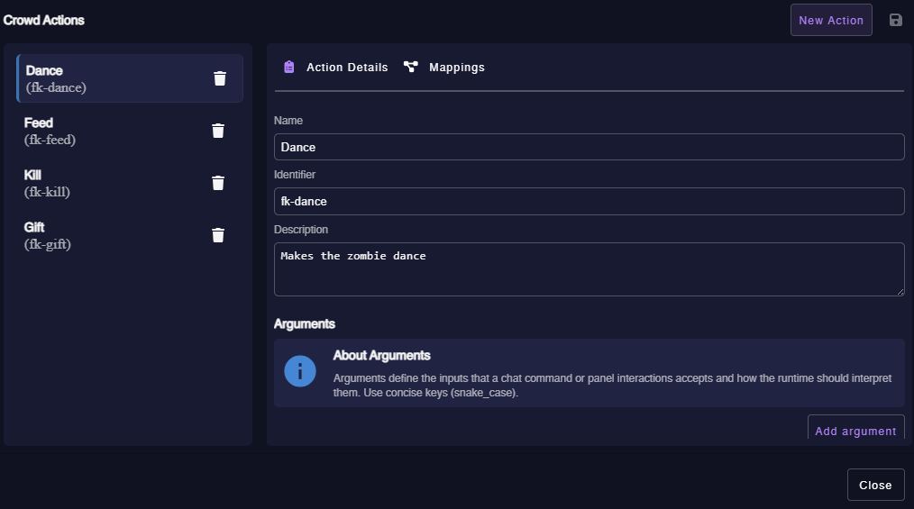
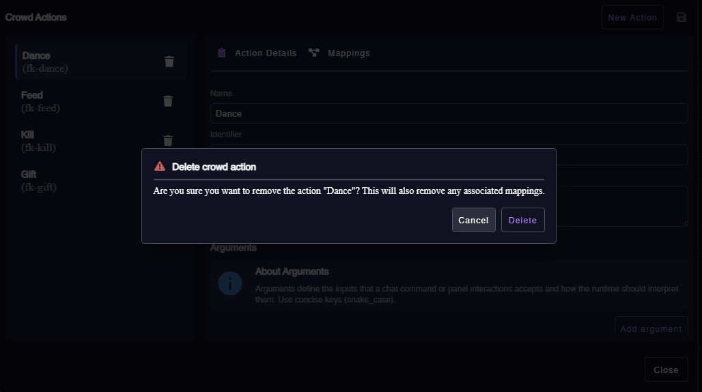
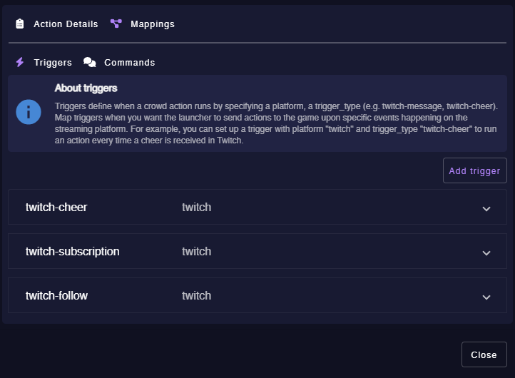
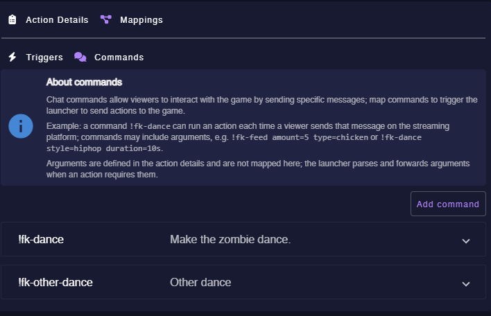
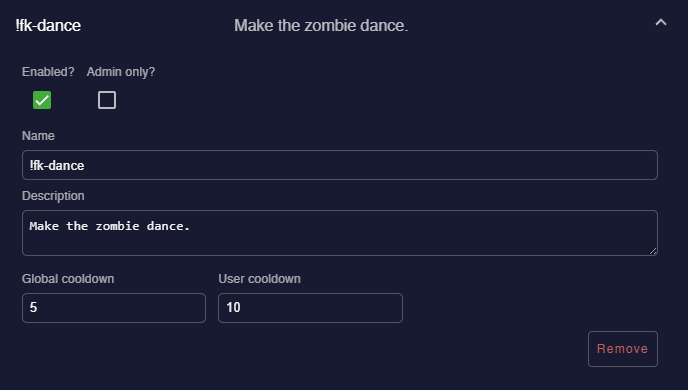
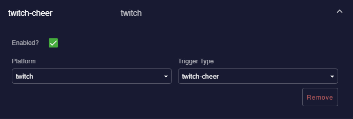

# Crowd Actions Panel — Version Editor (Admin Guide)

This document explains how an admin uses the Version Crowd Actions dialog (`VersionCrowdActionsDialogComponent`) in the Admin Panel to manage crowd actions for a specific game version.

> Note: screenshots referenced below are expected at `docs/game-designer/images/`:
>
> - `crowd-actions-overview.png`
> - `delete-confirmation.png`
> - `mappings-triggers.png`
> - `mappings-commands.png`
> - `command-detail.png`
> - `trigger-detail.png`

---

## Overview

The Version Crowd Actions dialog allows admins to create, edit and remove game actions that can be triggered by streaming platform events (triggers) or by chat commands. The dialog shows:

- Left column: list of actions for the version (selectable, with delete button).
- Right column: details editor for the selected action and a tab for Mappings (triggers & commands).



---

## Add a new action

1. Open the Version Crowd Actions dialog for the desired `game` and `version`.
2. Click **New Action** (top-right).
3. A new action is appended to the actions list and selected automatically.
4. In **Action Details** fill the fields:
   - **Name**: human-friendly label.
   - **Identifier**: unique identifier (auto-generated but editable).
   - **Description**: short description.
5. Add any arguments if the action requires input (see "Add arguments" section).
6. Switch to **Mappings → Triggers** / **Mappings → Commands** to attach triggers and/or chat commands.
7. Click the Save icon to persist changes to the backend.

> When saving, the client sends a combined payload (actions + mappings) to the server endpoint used by `GamesService.updateVersionCrowd`.

---

## Remove an action

1. In the left actions list, click the trash icon next to the action you want to remove.
2. Confirm deletion in the confirmation dialog.



3. The client removes the action locally and also removes any mappings that referenced the action's `identifier`.
4. Click Save to persist the deletion to the server.

---

## Add arguments (Action Details)

Arguments define inputs an action accepts. To add an argument:

1. Select an action in the left list so the **Action Details** view loads.
2. In the **Arguments** section click **Add argument**.
3. Fill the argument fields:
   - `Key`: unique key (use `snake_case`).
   - `Type`: choose one of the supported `ArgumentType` values.
   - `Required?`: whether the argument is mandatory at runtime.
   - `Default Value`: default value (type must match argument type).
4. Repeat for each argument.

The UI sends action `args` as part of the `CrowdAction` payload when calling Save. In the server payload the client converts `defaultValue` -> `default_value` where needed.

Example action fragment (server payload shape):

```json
{
  "identifier": "fk-dance",
  "name": "Dance",
  "description": "Make the zombie dance.",
  "args": [
    {
      "key": "amount",
      "type": "integer",
      "required": false,
      "default_value": 1
    }
  ]
}
```

---

## Add triggers (Mappings → Triggers)

1. Select the action and open the **Mappings** tab, then the **Triggers** subtab.
2. Click **Add trigger**.
3. For each trigger configure:
   - **Platform** (e.g. `twitch`).
   - **Trigger Type** (choose from the list of supported trigger types).
   - **Conditions** (optional): either leave empty or enter a valid JSON object.
   - **Enabled**: toggle on/off.
4. Empty `conditions` are normalized by the client to `null` before sending to the backend; if a non-empty string is provided the client will attempt to parse JSON and send an object.



Example trigger entry (server payload shape):

```json
{
  "platform": "twitch",
  "trigger_type": "twitch-cheer",
  "conditions": null,
  "is_enabled": true
}
```

---

## Add commands (Mappings → Commands)

1. Select the action and open the **Mappings** tab, then the **Commands** subtab.
2. Click **Add command**.
3. Fill command properties:
   - **Name**: command literal (e.g. `!fk-dance`).
   - **Aliases**: alternate tokens (the client normalizes arrays).
   - **Description**.
   - **Global cooldown** and **User cooldown** (seconds).
   - **Admin only**: whether only admins can run the command.
   - **Enabled**: toggle on/off.
4. Click Save to persist mappings.





Example command entry (server payload shape):

```json
{
  "name": "!fk-dance",
  "aliases": ["!fk-d"],
  "description": "Make the zombie dance.",
  "global_cooldown": 5,
  "user_cooldown": 10,
  "admin_only": false,
  "is_enabled": true
}
```

---

## Trigger detail example UI

When you expand a trigger, you can toggle Enabled and edit Platform / Trigger Type. The Conditions field expects JSON or empty value.



---

## Important notes

- The dialog keeps a local reactive form. Edits mark the form dirty — click the Save icon to persist.
- The client code normalizes empty trigger conditions to `null` before sending to the server to avoid `400 Bad Request` when conditions are optional.
- If you edit an action's `identifier`, ensure references in mappings are updated or re-created accordingly.

---

## Type definitions (source)

Below are the TypeScript types used by the client and server for crowd actions.

### ArgumentType (enum)

```ts
export enum ArgumentType {
  None = "none",
  String = "string",
  Integer = "integer",
  Float = "float",
  Boolean = "boolean",
}
```

### Argument

```ts
export interface Argument {
  key: string;
  type: ArgumentType;
  required: boolean;
  defaultValue?: any;
}
```

### ChatCommand

```ts
export interface ChatCommand {
  name: string;
  aliases: string[];
  description: string;
  global_cooldown: number;
  user_cooldown: number;
  admin_only: boolean;
  is_enabled: boolean;
}
```

### CrowdAction

```ts
export interface CrowdAction {
  identifier: string;
  name: string;
  description: string;
  args: Argument[];
}
```

### CrowdActionMapping

```ts
export interface CrowdActionMapping {
  identifier: string;
  triggers: any[]; // GameActionTrigger (see shared types)
  commands: ChatCommand[];
}
```

### VersionCrowdActionsDTO

```ts
export interface VersionCrowdActionsDTO {
  version_id: string;
  actions: CrowdAction[];
  mappings: CrowdActionMapping[];
}
```

---

## Files (reference)

- `app-shared-types/src/sg/crowd-actions/argument-type.ts`
- `app-shared-types/src/sg/crowd-actions/argument.ts`
- `app-shared-types/src/sg/crowd-actions/chat-command.ts`
- `app-shared-types/src/sg/crowd-actions/crowd-action.ts`
- `app-shared-types/src/sg/crowd-actions/crowd-action-mapping.ts`
- `app-shared-types/src/sg/crowd-actions/trigger.ts`
- `app-shared-types/src/sg/crowd-actions/version-crowd-actions.dto.ts`
